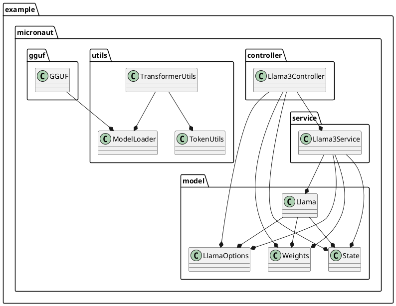
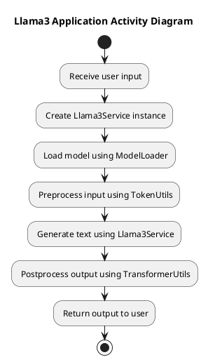

# Micronaut Llama3 Application

A high-performance Llama3 implementation using Micronaut and GraalVM Native Image.

## Getting Started

1. Clone the repository
```bash
git clone https://github.com/seehiong/micronaut-llama3.git
cd micronaut-llama3
```

2. Download required model:
- https://huggingface.co/mukel/Llama-3.2-1B-Instruct-GGUF
   
  Place these files in the project root directory.

### Prerequisites

* GraalVM 22.0.2 or later
* Java 23 with preview features enabled
* Gradle 8.10 or higher

### Building the Micronaut Application
```bash
./gradlew clean build

# Building the Native Image
./gradlew clean nativeCompile
```

### Running the Application
```bash
# Running native image
./build/native/nativeCompile/application.exe

# Or running micronaut in JDK mode
./gradlew run
```

## API Documentation

### Generate Text
```http
GET /api/llama3/generate?prompt=<your_prompt>
```
Generates text completion based on the provided prompt.

### Chat
```http
GET /api/llama3/chat?prompt=<user_prompt>&system_prompt=<system_prompt>
```
Handles chat interaction with optional system prompt for context setting.

## Configuration
Key configuration options in `application.properties`:
```properties
micronaut.application.name=llama3
llama.BatchSize=16
llama.VectorBitSize=0
llama.PreloadGGUF=Llama-3.2-1B-Instruct-Q4_0.gguf
options.model_path=Llama-3.2-1B-Instruct-Q4_0.gguf
options.temperature=0.1f
options.topp=0.95f
options.seed=-1
options.max_tokens=512
options.stream=true
options.echo=true
```

## Project Structure

```plaintext
micronuat-llama3/
├── src/
│   └── main/
│       ├── java/
│       │   └── example/
│       │       └── micronaut/
│       │           ├── controller/
│       │           │   └── Llama3Controller.java
│       │           ├── gguf/
│       │           │   ├── Float16.java
│       │           │   ├── GGMLTensorEntry.java
│       │           │   ├── GGMLType.java
│       │           │   ├── GGUF.java
│       │           │   ├── GGUFTensorInfo.java
│       │           │   └── MetadataValueType.java
│       │           ├── model/
│       │           │   ├── tensor/
│       │           │   │   ├── ArrayFloatTensor.java
│       │           │   │   ├── CategoricalSampler.java
│       │           │   │   ├── FloatTensor.java
│       │           │   │   ├── Q4_0FloatTensor.java
│       │           │   │   ├── Q8_0FloatTensor.java
│       │           │   │   ├── Sampler.java
│       │           │   │   └── ToppSampler.java
│       │           │   ├── ChatFormat.java
│       │           │   ├── Configuration.java
│       │           │   ├── Llama.java
│       │           │   ├── LlamaOptions.java
│       │           │   ├── Pair.java
│       │           │   ├── Parallel.java
│       │           │   ├── PartialModel.java
│       │           │   ├── State.java
│       │           │   ├── Tokenizer.java
│       │           │   ├── Vocabulary.java
│       │           │   └── Weights.java
│       │           ├── service/
│       │           │   └── Llama3Service.java
│       │           ├── utils/
│       │           │   ├── AOT.java
│       │           │   ├── ModelLoader.java
│       │           │   ├── RoPE.java
│       │           │   ├── SamplingUtils.java
│       │           │   ├── TensorUtils.java
│       │           │   ├── Timer.java
│       │           │   ├── TokenUtils.java
│       │           │   └── TransformerUtils.java
│       │           └── Application.java
│       └── resources/
│           ├── application.properties
│           └── logback.xml
└── build.gradle
```

## Architecture

### High-Level Class Diagram



### Activity Diagram



## Original Source

This project is a direct port of [llama3.java](https://github.com/mukel/llama3.java/tree/main) to a Micronaut application. The original implementation was contained in a single file `llama3.java`.